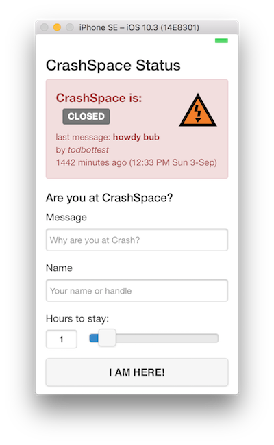

CrashSpaceStatus --- Cordova/PhoneGap version of "AtCrashSpace" app
====



To Build:
---
```
npm install cordova -g
cordova prepare
cordova build browser
cordova run browser
cordova build ios
cordova run ios
```


NOTES
------
- Must select "IPhone Developer Tod Kurt" in Target build settings
- Then check & uncheck "Automatically manage signing" in Target General settings
- When changing icons, run 'cordova-icon', the rebuild the 'ios' platofrm:
  ```
  cordova platform rm ios
  cordova platform add https://github.com/apache/cordova-ios.git#4.4.0-ios-sim
  ```
- If you want to watch `console.log()` messages in the simulator
  - `cordova build ios`
  - In Xcode, open `platforms/ios/CrashSpace Status.xcodeproj`
  - In Xcode, press 'Run'

```
-
